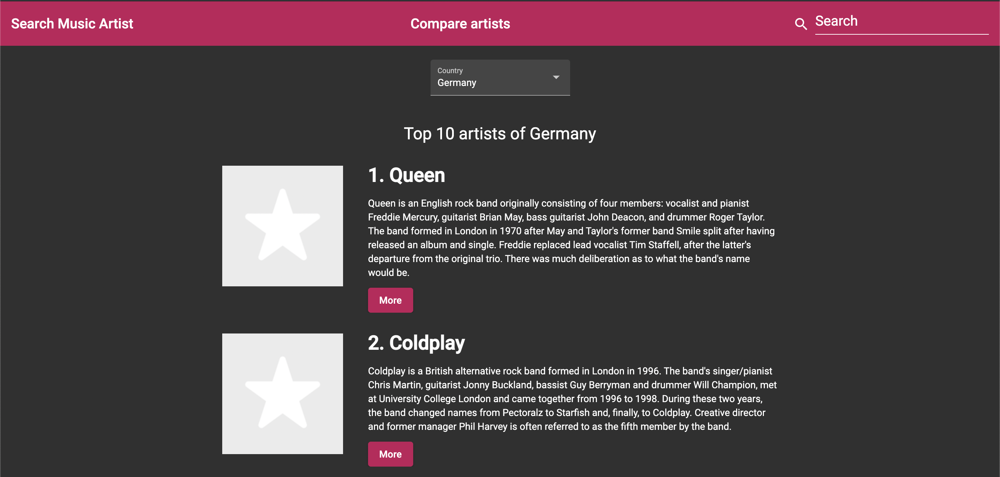

# SearchMusicArtist
Angular app for searching music artists with Last.fm API

<p align="center">
    <br>
</p>

## Versions
* [Angular CLI](https://github.com/angular/angular-cli) v12.0.3
* Angular v12.0.3
* Node v14.17.0
* Package Manager: npm 6.14.13

## Installation
1. Clone this repo `git clone https://github.com/KarenDeSantana/SearchMusicArtist`
1. `cd` into the folder of the cloned repo
1. Run `npm install` to install dependencies
1. Update the `LastFM API Key`
    * Obtain a free API key from LastFM [here](https://www.last.fm/api)
    * Go to `config.service.ts` and save your API keys into the file

        ```typescript
        export class ConfigService {
          API_KEY_LASTFM = '<your-lastFM-API-key-goes-here>';

            constructor(private http: HttpClient) { }
        ```
1. Run `ng serve`, and navigate to `http://localhost:4200/`
